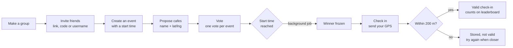
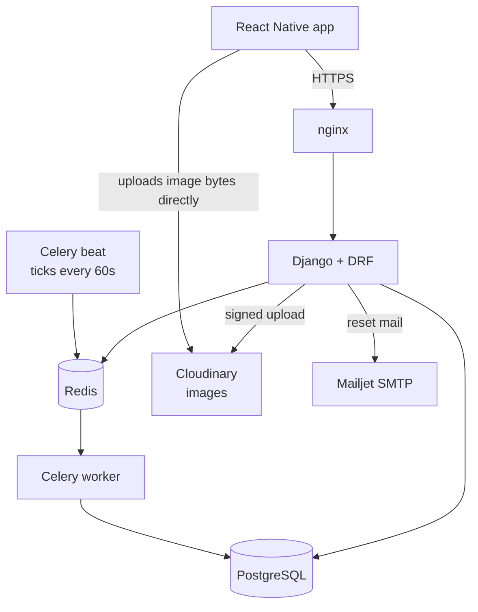
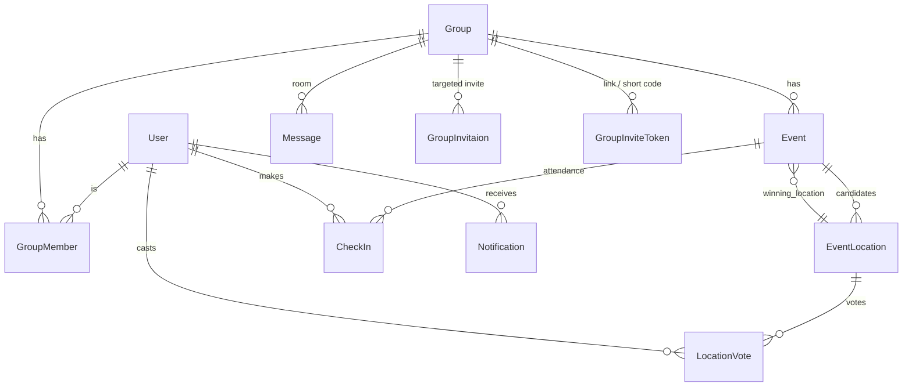

# ala_el_8ahwa

*3la el 8ahwa* — "on the coffee".

A JSON API for a small group of friends who keep saying "let's meet for coffee"
and never agree on where. You make a **group**, create an **event**, everyone
**proposes** cafes and **votes** for one, the app picks the winner when the
event starts, and you **check in** with your phone's GPS when you actually
show up.

Built with Django 6 + Django REST Framework. The client is a separate React
Native (Expo) app.

---

## The idea

The problem is not "where to meet". The problem is that nobody proves they
came. So the app does two things a group chat cannot:

1. **It closes the vote.** At the event's start time a background job freezes
   the winning location. No more changing minds, no more "I thought we said
   the other place".
2. **It checks the GPS.** A check-in is only counted if you are within 200 m
   of the winning cafe. Check-ins feed leaderboards, so showing up is worth
   something and flaking is visible.

Everything else — invites, the group chat room, notifications — exists to
support that loop.

---

## How it works



Rules worth knowing up front:

- **One vote per event**, not per location. Voting for a second cafe *moves*
  your vote. This is enforced by a database constraint, not by view code.
- **The freeze is permanent.** Ties are broken at random, once. An event that
  nobody voted on freezes with no winner and can never be checked in to.
- **A too-far check-in is still saved**, marked `is_valid: false`. Walk closer
  and post again to upgrade it. Once valid it can never be downgraded.
- **Check-ins cannot be edited or deleted.** There is no update or delete
  route for them by design.

---

## The pieces



Celery beat runs two jobs on a timer:

| Job | What it does |
|---|---|
| `freeze_due_winners` | Picks the winning location for every event whose start time has passed |
| `send_due_reminders` | Sends an `event_reminder` notification 60 minutes before an event |

If the worker is down, winners never freeze and check-ins are refused. The API
is not broken — it is waiting.

**Images never pass through Django.** The app asks the API for a signed upload
request, uploads the bytes straight to Cloudinary, then tells the API the new
version number. The file path is decided by the server, so nobody can upload
over someone else's picture.

---

## Data model



`leaderboard` has no models at all — the boards are counted live from
check-ins.

---

## The API

Base URL is the server root. Everything returns JSON. Everything except the
four public routes needs a header:

```
Authorization: Bearer <access token>
```

### Auth and account — `/users/`

| Method | Path | What it does |
|---|---|---|
| `POST` | `/users/register/` | `username`, `email`, `password`, optional `display_name`, optional `invite_token` / `invite_code` |
| `POST` | `/users/login/` | `identifier` (username **or** email) + `password`. Returns `access` + `refresh` |
| `POST` | `/users/token/refresh/` | Swap a refresh token for a new access token |
| `POST` | `/users/token/blacklist/` | Log out — kills the refresh token |
| `GET` | `/users/get_profile/` | Your own account, with `email` |
| `PUT` | `/users/update_profile/` | Change `username`, `email`, `display_name` |
| `POST` | `/users/change_password/` | `current_password`, `new_password` |
| `POST` | `/users/password_reset/` | `email`. Always answers `200`, even for an unknown address |
| `POST` | `/users/password_reset_confirm/` | `uid`, `token`, `new_password` |
| `DELETE` | `/users/delete_profile/` | Deletes the account and its tokens |
| `POST` | `/users/avatar_upload_signature/` | Get a signed Cloudinary upload |
| `POST` `DELETE` | `/users/avatar/` | Confirm (`version`) or remove the avatar |

**Public (no token):** `register`, `login`, `password_reset`,
`password_reset_confirm`.

Login is rate limited and only counts *failed* attempts, so typing your
password wrong twice never locks you out after you get it right.

### Groups — `/groups/`

| Method | Path | What it does |
|---|---|---|
| `GET` `POST` | `/groups/` | List your groups / create one (`name`, `desc`) |
| `GET` | `/groups/my_groups/` | Your groups with your role in each |
| `GET` | `/groups/<id>/` | One group |
| `PUT` `PATCH` | `/groups/<id>/update_group/` | Admin only |
| `DELETE` | `/groups/<id>/delete_group/` | Admin only |
| `GET` | `/groups/<id>/list_group_members/` | Members — no email addresses |
| `DELETE` | `/groups/<id>/leave_group/` | Leave |
| `POST` | `/groups/<id>/remove_member/` | Admin only, `user_id` |
| `POST` | `/groups/<id>/change_role/` | Admin only, `user_id` + `role` |
| `POST` `DELETE` | `/groups/<id>/image/` | Group picture (admin) |
| `POST` | `/groups/<id>/image_upload_signature/` | Signed upload (admin) |

### Joining a group

Two ways in.

**Targeted** — an admin invites a specific username, the invitee accepts:

| Method | Path | What it does |
|---|---|---|
| `POST` | `/groups/invitations/send_invite/` | `group_id` + `username_to_invite` |
| `GET` | `/groups/invitations/` | Your inbox |
| `GET` | `/groups/invitations/show_all_invitations/` | Same, all states |
| `POST` | `/groups/invitations/<id>/invite_responce/` | `action`: `accept` or `decline` |
| `POST` | `/groups/invitations/<id>/accept_invite/` | Accept |
| `POST` | `/groups/invitations/<id>/decline_invite/` | Decline |
| `DELETE` | `/groups/invitations/<id>/dismiss/` | Clear a resolved invite |

**Open link or short code** — an admin makes a token, anyone with it joins:

| Method | Path | What it does |
|---|---|---|
| `GET` `POST` | `/groups/<id>/invite_tokens/` | List / mint a token (admin). Optional `expires_in_hours`, `max_uses` |
| `POST` | `/groups/<id>/revoke_invite_token/` | `token_id` (admin) |
| `POST` | `/groups/join/` | `token` (long) or `code` (8 characters, case-insensitive) |
| `GET` | `/groups/invite/<code>/` | **Public preview** — group name, member count, picture, who invited |
| `GET` | `/invite/<code>/` | **Public HTML page** — the link you paste into WhatsApp |

The short code is eight characters from an alphabet with no `0`, `O`, `1`,
`I`, `L` or `U`, so a code read off a screen and typed by hand survives.
Joining is throttled to 10 tries an hour — that throttle is what makes a short
code safe.

### The group room — chat

| Method | Path | What it does |
|---|---|---|
| `GET` `POST` | `/groups/<id>/messages/` | Read the room / post `body` |

Members only, polling (no websockets). Paged by an opaque cursor — pass
`?before=<cursor>&limit=<n>` and read the next one from `next_before` in the
response. Never an offset, because new messages arrive at the top while you
scroll down.

Messages have a `kind`: `user` for people, `system` for things the app writes
itself ("Sara joined", "vote cast", "check-in accepted"). A system message
carries a structured `payload` so the app can render it in Arabic or English —
the English `body` is only a fallback.

### Events — `/events/`

| Method | Path | What it does |
|---|---|---|
| `GET` `POST` | `/events/` | Your groups' events / create one: `group_id`, `title`, `text`, `start_time`, `end_time` |
| `GET` | `/events/<id>/` | One event, with its locations |
| `PUT` `PATCH` `DELETE` | `/events/<id>/` | Creator only. Delete is blocked in the last 60 minutes before the start |
| `GET` | `/events/<id>/tally/` | Live vote standings |

### Locations and voting — `/event-locations/`

| Method | Path | What it does |
|---|---|---|
| `GET` | `/event-locations/?event=<id>` | Candidate cafes for an event |
| `POST` | `/event-locations/` | `event_id`, `name`, `latitude`, `longitude` |
| `GET` `PUT` `PATCH` `DELETE` | `/event-locations/<id>/` | Edit or drop your own proposal |
| `POST` | `/event-locations/<id>/vote/` | Vote. A second vote moves your old one |
| `DELETE` | `/event-locations/<id>/vote/` | Take your vote back |

### Check-ins — `/checkins/`

| Method | Path | What it does |
|---|---|---|
| `POST` | `/checkins/` | `event_id`, `latitude`, `longitude` |
| `GET` | `/checkins/` | Your own check-ins |
| `GET` | `/checkins/?event=<id>` | Who showed up to an event |
| `GET` | `/checkins/<id>/` | One check-in |
| `POST` | `/checkins/<id>/image_upload_signature/` | Signed upload, owner only |
| `POST` `DELETE` | `/checkins/<id>/image/` | Attach or remove your photo |

The event must be **active** and must already have a frozen winner. Distance
is computed on the server with a haversine over the stored coordinates — no
map API call, so there is nothing to fail on the hot path.

### Notifications — `/notifications/`

| Method | Path | What it does |
|---|---|---|
| `GET` | `/notifications/` | Yours only |
| `GET` | `/notifications/<id>/` | One |
| `GET` | `/notifications/unread_count/` | Badge number |
| `POST` | `/notifications/<id>/read/` | Mark one read |
| `POST` | `/notifications/read_all/` | Mark all read |

There is no create and no delete route — the server is the only writer. Unread
means `read_at` is `null`; it is a timestamp, not a boolean, so the app can
ask "what is new since I last looked".

Five kinds: `group_invite`, `invite_accepted`, `new_member`, `new_event`,
`event_reminder`.

### Leaderboards — `/leaderboard/`

| Method | Path | What it does |
|---|---|---|
| `GET` | `/leaderboard/?group=<id>` | Members of one group, by valid check-ins |
| `GET` | `/leaderboard/users/` | Every user in the app, by total valid check-ins |
| `GET` | `/leaderboard/groups/` | Every group, by check-ins ÷ (members × events) |

Only **valid** check-ins score anywhere — otherwise you could top the board
from your bed. Ties share a rank and skip the next one (1, 1, 3). The group
board needs at least 3 events *with a winner* before a group appears at all,
so one lucky night does not win forever.

---

## Rules the client should build on

- **Every error carries a `code`.** The app is Arabic and English, so it
  translates from the code and never from the English `message`.
  `core/errors.py` is the full list.

  ```json
  { "code": "already_voted", "message": "You already voted for this location." }
  ```

- **`404` is normal for outsiders.** Every query is scoped to the logged-in
  user, so an object you are not a member of simply does not exist for you.
  `403` means you *are* a member but lack the role or the ownership.
- **Server-owned fields are never writable**: `created_by`, `proposed_by`,
  `winning_location`, `is_valid`, `role`, `kind`, `sender`. Sending them does
  nothing.
- **Never send an email address in a roster.** No endpoint that shows one user
  to another includes `email`.

`CHANGELOG.md` lists the breaking changes. Read it before upgrading a client.

---

## Running it

Everything runs in Docker — the database host is a Compose service name, so
`manage.py` on your own machine cannot reach it. **Both `-f` flags are always
required**; the base file alone has no project name, no env file and no
published ports.

```bash
docker compose -f docker-compose.yml -f docker-compose.local.yml up --build
```

nginx serves on `:8001`, Django's dev server on `:8000`. The production
override is `docker-compose.prod.yml`, which serves on `:8002` through
gunicorn.

### Configuration

`settings.py` reads `.env.{DJANGO_ENV}` (default `.env.local`). These files are
gitignored; **`.env.example` is the tracked template listing every key** — copy
it and fill in real values. A missing required variable fails at startup with
`ImproperlyConfigured` naming the variable, so nothing starts half-configured.

### Tests

```bash
docker compose -f docker-compose.yml -f docker-compose.local.yml run --rm django-app python manage.py test
# one app, or one test class:
docker compose -f docker-compose.yml -f docker-compose.local.yml run --rm django-app python manage.py test events
docker compose -f docker-compose.yml -f docker-compose.local.yml run --rm django-app python manage.py test events.tests.EventCreateTests
```

361 tests. There is no pytest, no coverage tooling and no CI.

---

## Code layout

| App | What it owns |
|---|---|
| `users` | Custom user model, JWT auth, registration, password reset/change, avatars |
| `groups` | Groups, membership and roles, invitations, invite tokens and codes, the room |
| `events` | Events, candidate locations, voting, the winner freeze |
| `checkins` | Check-ins and the distance check |
| `notifications` | Typed notifications, written server-side only |
| `leaderboard` | Three live boards, no models |
| `core` | Shared helpers: error codes, permissions, geo, Cloudinary, throttling |
